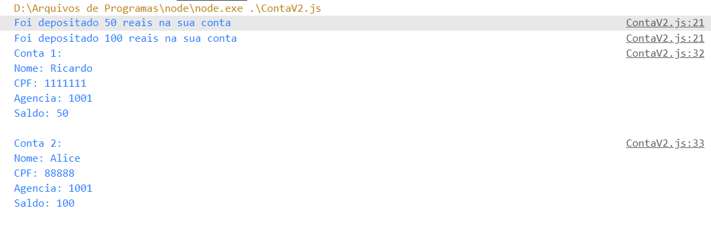

# Classes em Javascript
## História 
- A orientação a objetos com Javascript não é uma novidade, porém, enquanto várias outras linguagens utilizavam a sintaxe de classes, o Javascript continuava sem uso. 
- Isso sempre foi um detalhe importante que incomodava alguns desenvolvedores, pois assim ficava um pouco mais difícil de migrar entre tecnologias com facilidade. Ex: Migrar um Backend de PHP para NodeJS
- Sendo assim, a partir do ECMAScript 2015 (ES6), as classes começaram a fazer parte da linguagem. Isso não mudou ou adicionou funcionalidades, mas trouxe uma melhor organização para o código, além de entrar no padrão de outras tecnologias. 
- Leitura sobre Classes: https://imasters.com.br/desenvolvimento/programacao-orientada-objetos-em-javascript 
- Sobre o ECMASCRIPT: https://kenzie.com.br/blog/ecmascript-6/

# Problema a ser resolvido

Vamos fazer um programa que irá gerenciar contas bancárias de clientes. Cada conta terá as seguintes informações:
- Nome do cliente
- CPF
- Numero da Agencia
- Saldo
O programa deve permitir o usuario sacar, depositar e transferir(p/ outra conta) o dinheiro na conta. Alem disso deve permitir criar criar contas

- Vamos resolver esse problema, com o conhecimento que temos até agora: Funções e objetos. Crie um novo arquivo chamdado ``index.js``. Uma alternativa para fazermos o programa é criar uma função que 
    ```javascript
    /* ContaV1.js */
    function criarConta(nome,cpf,agencia,saldo){
        /*criando objeto conta */
        let conta = {
            /* atributo : parametro */ 
            nome: nome,
            cpf: cpf,
            agencia: agencia,
            saldo: saldo
        }
        //retornando a conta
        return conta;
    }

    /* c1 e c2 são objetos */
    let c1 = criarConta('Ricardo',1111111,1001,0)
    let c2 = criarConta('Alice',88888,1001,0)
    ```
    - O objetivo da função criarConta() é retornar um objeto que tenha todos os dados de uma conta(nome, cpf,agencia, saldo). Primeiro criamos um objeto do tipo conta (preenchendo os seus valores com os parâmetros) e depois retornamos o objeto.
    - As variáveis c1 e c2, recebem o resultado de criarConta(), ou seja, são dois objetos com a estrutura de uma conta com os valores passados por parametros


- Para resolver a funcionalidade de depositar podemos fazer a seguinte função:
    ```javascript
    /* c1 e c2 são objetos */
    c1 = criarConta('Ricardo',1111111,1001,0)
    c2 = criarConta('Alice',88888,1001,0)


    function depositar(conta,valor){
        conta.saldo += valor
    }
    /* realizando deposito */
    depositar(c1, 100)
    depositar(c2, 200)

    console.log(c1)
    console.log(c2)
    ```
    - Resolvemos parte do problema! O programa está criando 2 contas, e depositando valores. Porém temos alguns problemas. Se obsevarmos a função *depositar(conta,valor)*, não temos nenhuma garantia de que será passado como parâmetro da função um objeto da forma:
    ```javascript
    {
        nome: "",
        cpf: "",
        agencia: "",
        saldo:0
    }
    ```
    - Também temos como problema, a chamada da função ``depositar``:
    ```javascript
    depositar(c1, 100)
    depositar(c2, 200)
    ```
    - O ideal é que pudessemos realizar a chamada desta maneira: ``c1.depositar(100)`` (Da mesma maneira que utilizamos os métodos de arrays: ``push``, ``forEach``, ``map``...)

- Uma solução é refatorar o método ``criarConta()``:
    ```javascript
    function criarConta(nome,cpf,agencia,saldo){
        /*criando objeto conta */
        let conta = {
            /* atributo : parametro */ 
            nome: nome,
            cpf: cpf,
            agencia: agencia,
            saldo: saldo,
            /* adicionando a função (método) depositar */
            depositar: function(valor){
                this.saldo +=valor
            }
        }
        return conta;
    }
    ```
- Refatorando a chamada dos métodos contas:
```javascript
/*
function depositar(conta,valor){
    conta.saldo += valor
}*/

/* realizando deposito */
c1.depositar(100)
c2.depositar(200)

console.log(c1)
console.log(c2)
```
- De certa forma, criamos uma classe. Porém, de uma meneira bem diferente das outras linguagens.

## Classe
- Classe é uma estrutura que descreve propriedades(atributos) e comportamentos(métodos) de um determinado objeto.
- A definição de um classe, é como se criasse um novo tipo de dados. A partir de uma classe podem ser criados novos objetos, com uma estrutura em comum(atributos e métodos). O nome dessa operação é **INSTANCIAR OBJETOS**
- Vamos criar um novo arquivo ``ContaV2.js``
    ```javascript
    /* Classe conta */
    class Conta{
        /* declaração de atributos */
        nome;
        cpf;
        agencia;
        saldo;
        /* metodo construtor */
        constructor(nome,cpf,agencia,saldo){
            /*inicializando atributos */
            this.nome = nome
            this.cpf = cpf;
            this.agencia = agencia
            this.saldo = saldo
        }
    }
    ```
## Keyword *class*
- A palavra chave ``class`` é utilizada para criar um classe. Por padrão, as classes são nomeadas com nome maiúsculo para diferenciar dos objetos comuns.
- Começamos com  a **declaração dos atributos**. Criamos os atributos nome,cpf,agencia,saldo separados por **;** 
    - OBS: Em javascript, por se fracamente tipada, a declaração de atriubutos não é obrigatória. Mas é extremamente recomendado
- Depois criamos o primeiro **método da classe** chamado *constructor*. O método é como se fosse uma função, porém dentro da classe. A vantagem é que todos os objetos da classe implementam os métodos.
## Método *constructor* 
- O método *constructor* é o conhecido método construtor da classe. Este método é chamado TODA VEZ que instanciamos um novo objeto da classe. Ou seja, ele "constrói" um novo objeto
- Geralmente, o método construtor tem o papel de inicializar os atributos do novo objeto. Ou seja, no código estamos incializando os 4 atributos.
- O método construtor tem 4 parâmetros:
    ```javascript
    /* parâmetros */
    constructor(nome,cpf,agencia,saldo){

    }
    ```
    - Esses parâmetros devem ser passados quando instaciamos o objeto
- Para inicializar os atributos utilizamos a palavra ``this``:
    ```js
    class Conta{
        .......
        constructor(nome,cpf,agencia,saldo){
            /*inicializando atributos */
            this.nome = nome
            this.cpf = cpf;
            this.agencia = agencia
            this.saldo = saldo
        }
    }
    ```
## Referenciando a própria classe: *this*
Esta palavra é utilizada em diversas linguagens de programação e sempre gera as seguintes dúvidas:
- Quem é ``this``?
- Para que serve o ``this``?
- Por que utilizar o ``this``?
- Quando usar o ``this``?

### Quem é this?
- Quando utilizamos ``this`` trata-se do próprio escopo atual onde o mesmo está sendo referenciado, ou seja, dentro da classe o this nada mais é do que uma referência da própria classe.
### Para que serve o ``this``
- Para referenciarmos a própria classe (tratando-se apenas de OO) dentro de funções ou métodos.
### Por que utilizar o ``this``?
- Para referenciar atributos ou métodos da própria classe dentro de outros métodos da mesma classe.
### Quando usar o ``this``?
- Quando precisa-se invocar ou pegar valores de atributos ou funções da própria classe.

## Criando um objeto ``Conta``:
- Vamos agora instanciar um novo objeto da classe Conta
    ```javascript
    let c1  = new Conta('Ricardo',1111111,1001,0)

    console.log(c1)
    ```
    - Para instanciar um objeto utilizamos a palavra chave ``new``. 
    - Quando um objeto é instanciado, o método construtor é chamado. Perceba que passamos 04 parâmetros para o método.

Em Resumo: Criamos uma classe ``Conta`` e a partir dela, podemos criar novos objeto padronizados.

## Método toString()
- Agora vamos a criação de outros métodos para conta. O método ``toString()`` é bem conhecido de outras linguagens, e ele é utilizado para transforma um objeto para um string, mostrando os valores dos atributos
- Veja a implementação:
    ```javascript
    /* Classe conta */
    class Conta{
         // ...... continuação

        /* criação do método toString() */
        toString(){
            return `Nome: ${this.nome}\n`+
                    `CPF: ${this.cpf}\n`+
                    `Agencia: ${this.agencia}\n`+
                    `Saldo: ${this.saldo}\n`
        }
    }
    ```
    - Retornamos uma string, que mostra os valores do objeto. Perceba que fizemos uso do ``this`` para acessar os atributo.
-  Fora da classe utilize o método ``toString()``:
    ```javascript
    let c1  = new Conta('Ricardo',1111111,1001,0)
    let c2 = new Conta('Alice',88888,1001,0)
    //realizando a chamada dos métodos
    console.log("Conta 1: \n"+c1.toString())
    console.log("Conta 2: \n"+c2.toString())
    ```
## Método deposita()
- Agora vamos implementar o método ``deposita()``. Este método tem a função de aumentar o saldo de uma conta
- Veja a implementação:
    ```javascript
    class Conta{
         // ...... continuação

        /* criação do método deposita(valor) */
        deposita(valor){
            if(valor <= 0 ){
                console.log('Valor invalido!')
                return ;// quebra a execução do método
            }
            //aumentar o saldo
            this.saldo += valor;
            //mensagem confirmação
            console.log(`Foi depositado ${this.saldo} reais na sua conta ${this.nome}`)
        }
    }
    ```
    - Este método recebe como parâmetro valor e aumenta o valor do atribuito ``saldo``
    - Fizemos uma verificação, caso o valor seja igual a zero, mostra uma mensagem de valor inválido
    - Uma mensagem no console é mostrada caso o valor seja depositado com sucesso. Novamente usamos a palavra ``this`` para acessar os atributos
- Fora da classe podemos chamar o método, para as duas contas criadas:
```javascript
let c1  = new Conta('Ricardo',1111111,1001,0)
let c2 = new Conta('Alice',88888,1001,0)
//depositando valor em c1 e c2
c1.deposita(50)
c2.deposita(100)

console.log("Conta 1: \n"+c1.toString())
console.log("Conta 2: \n"+c2.toString())
```
- Temos como saída no console: 
    -    
## Método saque()
- Agora vamos implementar o método de saque. Este método tem como objetivo realizar o saque de um valor de uma conta. Veja o método a seguir:
    ```javascript
    class Conta{
        ......
        /* metodo para fazer um saque de um valor */
        saque(valor){
            //caso nao tenha valor suficiente
            if(valor > this.saldo){
                console.log("Não tem saldo suficiente!")
                return;
            }
            //caso valor invalido
            if( valor <= 0 ){
                console.log("Valor invalido")
                return;
            }
            this.saldo -= valor;
            console.log("Saque realizado com sucesso");
        }
    ```
- Fora da classe execute os seguintes comandos:
    ```js
    let c1 = new Conta('Ricardo',111111,1001,0)
    let c2 = new Conta('Alice',2323232,1111,0)

    c1.deposita(50)
    c2.deposita(150)

    c1.saque(25)
    c2.saque(50)

    console.log( 'Conta 1: \n'+c1.toString() )
    console.log( 'Conta 2: \n'+c2.toString() )
    ```
    - No código acima estamos criando duas contas c1 e c2. Depositamos 50 e 150 em c1 e c2, e depois realizamos um saque de 25 e 50.

# Códig da aula do dia 23/09
- Link:

# Referências
- JS assíncrono: callbacks, promises e async functions: https://medium.com/@alcidesqueiroz/javascript-ass%C3%ADncrono-callbacks-promises-e-async-functions-9191b8272298
- POO: Trabalhando com classes e objetos em JS: https://www.devmedia.com.br/poo-trabalhando-com-classes-e-objetos-em-javascript/28434
- https://blog.matheuscastiglioni.com.br/orientacao-a-objetos-com-javascript/ 