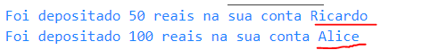

# Classes em Javascript
## História 
- A orientação a objetos com Javascript não é uma novidade, porém, enquanto várias outras linguagens utilizavam a sintaxe de classes, o Javascript continuava sem uso. 
- Isso sempre foi um detalhe importante que incomodava alguns desenvolvedores, pois assim ficava um pouco mais difícil de migrar entre tecnologias com facilidade. Ex: Migrar um Backend de PHP para NodeJS
- Sendo assim, a partir do ECMAScript 2015 (ES6), as classes começaram a fazer parte da linguagem. Isso não mudou ou adicionou funcionalidades, mas trouxe uma melhor organização para o código, além de entrar no padrão de outras tecnologias. 
- Leitura Complementar: https://kenzie.com.br/blog/ecmascript-6/
## Problema a ser resolvido

Vamos fazer um programa que irá gerenciar contas bancárias de clientes. Cada conta terá as seguintes informações:
- Nome do cliente
- CPF
- Numero da Agencia
- Saldo
O programa deve permitir o usuario sacar, depositar e transferir(p/ outra conta) o dinheiro na conta. Alem disso deve permitir criar criar contas

Crie um novo arquivo chamdado ``index.js``. Uma alternativa para fazermos o programa é criar uma função que 
```javascript
/* ContaV1.js */
function criarConta(nome,cpf,agencia,saldo){
    /*criando objeto conta */
    let conta = {
        /* atributo : parametro */ 
        nome: nome,
        cpf: cpf,
        agencia: agencia,
        saldo: saldo
    }

    return conta;
}

/* c1 e c2 são objetos */
c1 = criarConta('Ricardo',1111111,1001,0)
c2 = criarConta('Alice',88888,1001,0)
```

- Para resolver a funcionalidade de depositar podemos fazer a seguinte função:
```javascript
/* c1 e c2 são objetos */
c1 = criarConta('Ricardo',1111111,1001,0)
c2 = criarConta('Alice',88888,1001,0)


function depositar(conta,valor){
    conta.saldo += valor
}
/* realizando deposito */
depositar(c1, 100)
depositar(c2, 200)

console.log(c1)
console.log(c2)
```
- Resolvemos parte do problema! O programa está criando 2 contas, e depositando valores. Porém temos alguns problemas. Se obsevarmos a função *depositar(conta,valor)*, não temos nenhuma garantia de que será passado como parâmetro da função um objeto da forma:
```javascript
{
    nome: "",
    cpf: "",
    agencia: "",
    saldo:0
}
```
- Também temos como problema, a chamada da função ``depositar``:
    ```javascript
    depositar(c1, 100)
    depositar(c2, 200)
    ```
    - O ideal é que pudessemos realizar a chamada desta maneira: ``c1.depositar(100)`` (Da mesma maneira que utilizamos os métodos de arrays: ``push``, ``forEach``, ``map``...)
- Uma solução é refatorar o método ``criarConta()``:
    ```javascript
    function criarConta(nome,cpf,agencia,saldo){
        /*criando objeto conta */
        let conta = {
            /* atributo : parametro */ 
            nome: nome,
            cpf: cpf,
            agencia: agencia,
            saldo: saldo,
            /* adicionando a função (método) depositar */
            depositar: function(valor){
                this.saldo +=valor
            }
        }
        return conta;
    }
    ```
- Refatorando a chamada dos métodos contas:
```javascript
/*
function depositar(conta,valor){
    conta.saldo += valor
}*/

/* realizando deposito */
c1.depositar(100)
c2.depositar(200)

console.log(c1)
console.log(c2)
```
- De certa forma, criamos uma classe. Porém, de uma meneira bem diferente das outras linguagens.

## Classe
- Classe é uma estrutura que descreve propriedades(atributos) e comportamentos(métodos) de um determinado objeto.
- A definição de um classe, é como se criasse um novo tipo de dados. A partir de uma classe podem ser criados novos objetos, com uma estrutura em comum(atributos e métodos). O nome dessa operação é **INSTANCIAR OBJETOS**
- Vamos criar um novo arquivo ``ContaV2.js``
    ```javascript
    /* Classe conta */
    class Conta{
        /* metodo construtor */
        constructor(nome,cpf,agencia,saldo){
            /*inicializando atributos */
            this.nome = nome
            this.cpf = cpf;
            this.agencia = agencia
            this.saldo = saldo
        }
    }
    ```
    - A palavra chave ``class`` é utilizada para criar um classe. Por padrão, as classes são nomeadas com nome maiúsculo para diferenciar dos objetos comuns.
    - O método construtor é chamado TODA VEZ que instaciamos um  objeto. 
    - Perceba que o método construtor tem 4 parâmetros. Ou seja, se quisermos criar uma nova conta, 
    - Dentro do método construtor criamos 04 atributos
        - ``this.altura``
        - ``this.largura``
        - ``this.agencia``
        - ``this.saldo``
    - A palavra ``this``, vem do inglês "esse", e ela é utilizada, quando queremos pegar o valor do atributo, ou pegar utilizar um método DENTRO da classe. 
- Vamos agora instanciar um novo objeto da classe Conta
    ```javascript
    let c1  = new Conta('Ricardo',1111111,1001,0)

    console.log(c1)
    ```
    - Para instanciar um objeto utilizamos a palavra chave ``new``. 
    - Quando um objeto é instanciado, o método construtor é chamado. Perceba que passamos 04 parâmetros para o método.
<h4> Em Resumo: Criamos uma classe ``Conta`` e a partir dela, podemos criar novos objeto padronizados.</h4>

# Criação de métodos

## Método toString()
- Vamos criar um método para retornar uma string com informações do objeto (**toString()**) 
    ```javascript
    /* Classe conta */
    class Conta{
         // ...... continuação

        /* criação do método toString() */
        toString(){
            return `Nome: ${this.nome}\n`+
                    `CPF: ${this.cpf}\n`+
                    `Agencia: ${this.agencia}\n`+
                    `Saldo: ${this.saldo}\n`
        }
    }
    ```
-  Utilizando o método ``toString()``:
    ```javascript
    let c1  = new Conta('Ricardo',1111111,1001,0)
    let c2 = new Conta('Alice',88888,1001,0)
    //realizando a chamada dos métodos
    console.log("Conta 1: \n"+c1.toString())
    console.log("Conta 2: \n"+c2.toString())
    ```
    - Este método é bem útil para mostrar a conta de uma forma diferente da impressão de objetos
- Agora vamos implementar o método ``deposita()``:
    ```javascript
    class Conta{
         // ...... continuação

        /* criação do método deposita(valor) */
        deposita(valor){
            this.saldo += valor;
            console.log(`Foi depositado ${this.saldo} reais na sua conta`)
        }
    }
    ```
    - Este método recebe como parâmetro valor e aumenta o valor do atribuito ``saldo``
- Fora da classe podemos chamar o método, para as duas contas criadas:
```javascript
let c1  = new Conta('Ricardo',1111111,1001,0)
let c2 = new Conta('Alice',88888,1001,0)
//depositando valor em c1 e c2
c1.deposita(50)
c2.deposita(100)

console.log("Conta 1: \n"+c1.toString())
console.log("Conta 2: \n"+c2.toString())
```
- Temos como saída no console: 
    -    

- Exercício: Modifique o método saca() para mostrar o nome do usuario:
    - 
- 

# Referências
- JS assíncrono: callbacks, promises e async functions: https://medium.com/@alcidesqueiroz/javascript-ass%C3%ADncrono-callbacks-promises-e-async-functions-9191b8272298
- POO: Trabalhando com classes e objetos em JS: https://www.devmedia.com.br/poo-trabalhando-com-classes-e-objetos-em-javascript/28434