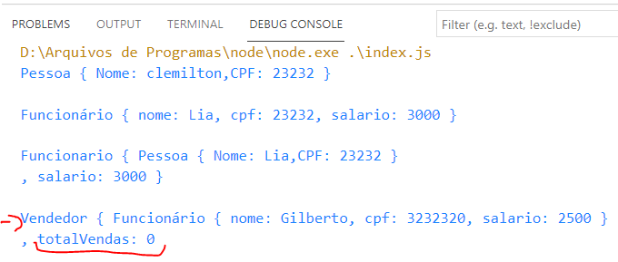

# Classes e Herança


## <li>Herança é uma forma de reutilização de software, onde uma nova classe é criada absorvendo dados de uma classe existente.</li>
## <li>A classe nova é chamada de SUBCLASSE, já a classe antiga, que é absorvida pela nova, é chamada de SUPERCLASSE </li>
## <li> A herança pode se dar em vários níveis, formando uma hierarquia</li>
## <li>A classe filha terá todos os atributos e métodos da classe pai </li>
## <li>Vamos implementar o seguinte modelo: </li>
- 
    - 
    - A figura acima demonstra um diagrama de classes. O diagrama de classes é uma modelagem que permite visualizar os atributos, métodos e hierarquias de uma classe.
    - Cada classe é representado em um compartimento de 3 espaços. 
        - 1º compartimento: Nome da classe
        - 2º compartimento: Atributos
        - 3º compartimento: Métodos
    - A seta entre Funcionário e Pessoa, indica quem Funcionário é classe filha de Pessoa. Ou seja, Funcionário irá ter os atributos e métodos de pessoa.
# 1 - Pessoa.js
- Vamos desenvolver a classe ``Pessoa.js``
    ```js
    export class Pessoa {
        #nome;
        #cpf

        constructor(nome,cpf ){
            this.#nome = nome;
            this.#cpf = cpf
        }

        get nome(){
            return this.#nome;
        }

        set nome(nome){
            this.#nome = nome;;
        }

        get toString(){
            return  `Pessoa { `+
            `Nome: ${this.nome}`+ `,CPF: ${this.#cpf} } \n`;
        }

    }
    ```
    - Nesta classe criamos:
        -  atributos privados: #nome  e #cpf
        - get e set do atributos nome
        - get toString(): para retornar os dados do objeto.
- Crie um arquivo chamado ``index.js``:
    ```js
    import {Pessoa} from './Pessoa.js'

    let p = new Pessoa("clemilton","23232");
    console.log(p.toString)
    ```
    - Deve ser impresso no console os dados do objeto, junto com o nome da classe.
    - 

# Funcionário.js
- Vamos implementar a classe funcionário: 
```javascript
import { Pessoa } from "./Pessoa.js";
/* Funcionario é uma pessoa 
A classe Funcionário tem:
    - todos os atributos de Pessoa
    - todos os métodos de Pessoa
*/
export class Funcionario extends Pessoa{
    #salario;
    constructor(nome,cpf,salario){
        // super() -> chama o construtor da classe pai
        super(nome,cpf); //inicializando atributos de Pessoa
        this.#salario = salario; 
    }
}
```
- Primeiro perceba que importamos a classe ``Pessoa`` dentro do arquivo da classe ``Funcionario``. Trabalhando com módulos isso é possível, sem se preocupar com a ordem de chamada dos arquivos:
    ```javascript
    import { Pessoa } from "./Pessoa.js";
    ```
- Depois utilizamos a palavra **extends** para dizer que Funcionário é SUBCLASSE de Pessoa:
    ```javascript
    export class Funcionario extends Pessoa{
        #salario
    }
    ```
    - Isto faz com que TODOS os atributos e métodos de ``Pessoa``, passem para a classe ``Funcionário``
    - O atributo ``salario`` será somente da classe funcionário
- Método construtor: 
    ```javascript
    constructor(nome,cpf,salario){
        // super() -> chama o construtor da classe pai
        super(nome,cpf); //inicializando atributos de Funcionario
        this.#salario = salario; 
    }
    ```
    - O método construtor inicializa os atributos da classe ``Pessoa``(nome e cpf), e o atributo ``#salario``.
    - O comando **super** faz referência a classe pai da atual. Ou seja, utilizamos **super()**, estamo chamando o construtor da classe pai. O construtor da clase ``Pessoa`` tem dois parâmetros: nome e cpf.
    - Depois inicializamos o atributo ``#salario`` da classe Funcionario

- Agora volte ao arquivo ``index.js``:
    ```js 
    import { Funcionario } from './Funcionario.js';
    import {Pessoa} from './Pessoa.js'

    let p = new Pessoa("clemilton","23232");
    console.log(p.toString); //imprimindo Pessoa

    let f = new Funcionario("Lia","23232",3000);
    console.log(f.toString); // imprimindo funcionário
    ```
    - Obtemos como saída no console: 
    - Perceba que não foi impreso o salário do objeto Funcionário. Isso aconteceu pois ao executar o comando ```console.log(f.toString)```, estamos chamando o método da classe Pessoa e não do Funcionário. Para imprimir o salário, vamos implementar ``toString()`` em ``Funcionario``:
- Implementação ``toString()``:
```js
export class Funcionario extends Pessoa
    get toString(){
        return `Funcionário { `+
              `nome: ${this.#nome}, `+
              `cpf: ${this.#cpf}, `
              `salario: ${this.#salario} }\n`;
    }
```

- Ao executar ``index.js``:
    - 
    - Isto aconteceu pois estamos tentando acessar o atributo ``this.#nome``, porém este atributo é PRIVADO da classe Pessoa. Lembrando, atributos privados podem ser acessados somente dentro da própria classe. 
        - OBS: Outras linguagens tem o atributo do tipo ``protected`` onde os atributos são acessíveis na sua subclasse
    - Então como acessamos os valores dos atributos da classe pai? ** R= getters e setters **
- Volte a classe ``Pessoa.js`` e implemente o get e o set do atributo cpf:
    ```js
    export class Pessoa {
        ...
        get cpf(){
            return this.#cpf;
        }
        set cpf(cpf){
            this.#cpf = cpf;
        }
    }
    ```
- Refatore o método ``toString()`` em ``Funcionario.js``:
    ```js
    export class Funcionario extends Pessoa{
        get toString(){
            return `Funcionário { `+
                `nome: ${this.nome}, `+
                `cpf: ${this.cpf}, `
                `salario: ${this.#salario} }\n`;
        }
    ```
    - OBS: ``this.nome`` e ``this.cpf`` são os métodos *get* da classe ``Pessoa``
- Obtemos como saída em ``index.js``:
    - 
    - Dessa vez, conseguimos ver os atributos da classe funcionário.
- Vamos fazer um versão do método toString em ``Funcionario.js``
    ```js
    export class Funcionario extends Pessoa{
        ...
        get toString2(){
            return `Funcionario { `+
                    //acessando toString da classe Pessoa
                    `${super.toString}, `+
                    `salario: ${this.#salario} }\n`;
        }
    }
    ```
    - Nesta versão, fazemos uso do ``super`` para acessar o método da classe pai.
- Modifique ``index.js``:
 ```js
import { Funcionario } from './Funcionario.js';
import {Pessoa} from './Pessoa.js'

let p = new Pessoa("clemilton","23232");
console.log(p.toString)

let f = new Funcionario("Lia","23232",3000);
console.log(f.toString)
console.log(f.toString2)
 ```
 - Implementação dos métodos *get* e *set* do atributo ``#salario``
 ```js
export class Funcionario extends Pessoa{
    ...
    get salario(){
        return this.#salario;
    }

    set salario(s){
        this.#salario = s;
    }
}
 ```
# Classe Vendedor.js
- Faça o seguinte código em ``Vendedor.js``: 
    ```js
    import { Funcionario } from "./Funcionario.js";

    export class Vendedor extends Funcionario {
        #totalVendas

        constructor(nome,cpf,salario){
            super(nome,cpf,salario)
            //iniciar totalVendas com 0
            this.#totalVendas = 0;
        }
        /* get e set totalVendas */
        get totalVendas(){
            return this.#totalVendas;
        }
        set totalVendas(total){
            this.#totalVendas = total;
        }

        get toString(){
            return `Vendedor { `+
                    `${super.toString}, `+
                    `totalVendas: ${this.#totalVendas}`
        }
    }
    ```
    - Criamos uma classe ``Vendedor`` que herda de ``Funcionario``. Tem o atributo ``totalVendas`` que será utilizado para realizar um cálculo diferenciado do salário.  
- Em ``index.js``:
    ```js
    import { Funcionario } from './classes/Funcionario.js';
    import {Pessoa} from './classes/Pessoa.js'
    import { Vendedor } from './classes/Vendedor.js';

    let p = new Pessoa("clemilton","23232");
    console.log(p.toString)

    let f = new Funcionario("Lia","23232",3000);
    console.log(f.toString)
    console.log(f.toString2)

    let v = new Vendedor("Gilberto","3232320",2500);
    console.log(v.toString);
    ```
    - Saída no console: 


# Continua ...
